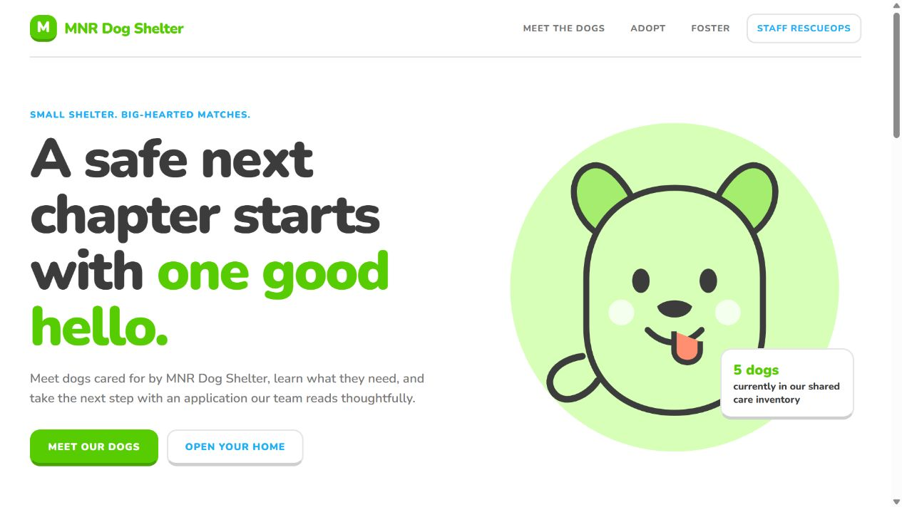
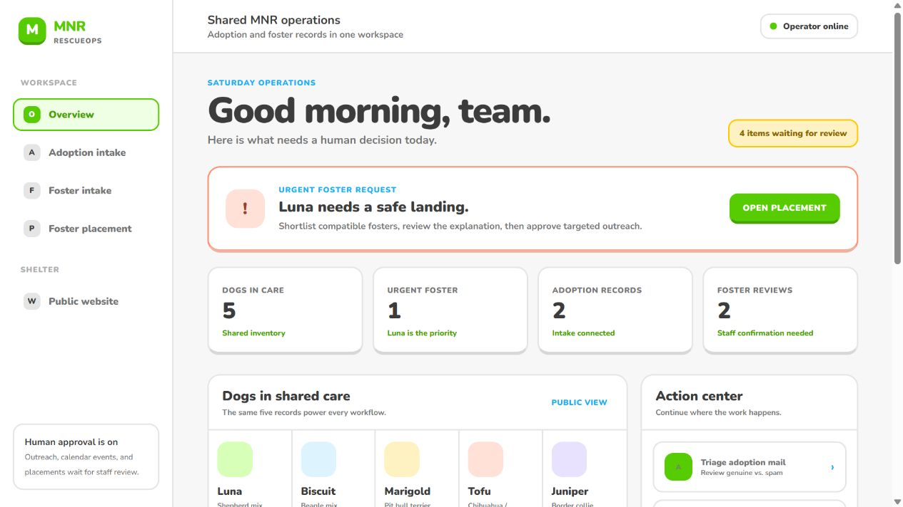

# MNR Dog Shelter / RescueOps

**Live demo:** [https://dogathon-dun.vercel.app](https://dogathon-dun.vercel.app)

An **ambient agent**: nobody prompts it. A dog rescue's adoption form emails an
intake mailbox, a local server notices, and an agent handles the application end
to end — appends a row to a Google Sheet, posts to Slack, books a meet-and-greet,
and drafts a reply for a human to send.

Every tool call goes through an [Arcade](https://arcade.dev) MCP gateway, so the
agent acts **as you**, with your Google and Slack grants, and never holds a
credential.

The same server also includes a resettable **Foster Placement** thin slice at
**http://localhost:4111/foster**. It demonstrates a staff-controlled loop from
fresh foster availability through placement closure without changing the
existing adoption intake demo.

A companion **Foster Application Intake** runs at
**http://localhost:4111/foster-intake**. Its public form at
**http://localhost:4111/foster-apply** feeds Gmail, then a dedicated
foster-intake agent records qualified homes in the foster roster, alerts Slack,
books a home visit, and drafts a reply. Together the demos cover intake first,
then trustworthy placement coordination.

## Adoption vs. fostering

These are two different commitments that begin with separate public forms:

| Application | What the person is offering | What RescueOps evaluates |
| --- | --- | --- |
| **Adoption** | A permanent home and long-term ownership of one dog | Household fit, lifestyle, care plan, and readiness for a meet-and-greet |
| **Fostering** | A temporary home while the shelter continues supporting the dog and looking for a permanent adopter | Current availability, capacity, experience, transport, preferences, and restrictions |

An adopter applies for a lasting match. A foster volunteer may temporarily care
for several dogs over time, so RescueOps saves an approved foster profile and
reuses it when a compatible dog needs placement. In the synthetic demo, Maya
fosters Luna temporarily; she is not adopting Luna.

### Public shelter



### Staff RescueOps



```
public form  ──▶  Gmail  ──▶  poller (Arcade SDK)  ──▶  agent (MCP gateway)  ──┬─▶ Google Sheet
 /apply           inbox        every 10s                  Mastra + Claude      ├─▶ Slack
                                                                               ├─▶ Calendar
                                                                               └─▶ Gmail draft
```

## Setup

You need an Arcade account, a Google account you don't mind filling with fake dog
adoption data, and access to a Slack workspace.

```bash
npm install
cp .env.example .env      # fill in ARCADE_API_KEY, ARCADE_USER_ID, ANTHROPIC_API_KEY
npm run seed              # builds the adopter Sheet in YOUR Google account
npm start
```

Then create an MCP gateway at [app.arcade.dev](https://app.arcade.dev) with these
eight tools, and set its auth to **Members of this Project (Arcade Auth)**:

| Toolkit | Tools |
| --- | --- |
| Gmail | `SearchEmailsByQuery`, `WriteDraftReplyEmail`, `SendEmail` |
| Google Sheets | `SearchSpreadsheets`, `InspectSpreadsheet`, `CreateOrEditSpreadsheet` |
| Google Calendar | `CreateEvent` |
| Slack | `SendMessage` |

Keep the toolset narrow. A model given four hundred tools picks worse than a
model given eight.

## Running it

### MNR shelter and RescueOps

Open **http://localhost:4111** for the public MNR Dog Shelter site and
**http://localhost:4111/ops** for the shared RescueOps dashboard, then open
**http://localhost:4111/adoption-intake** for the adoption intake console.

### Shared RescueOps platform — no credentials required

To run the new synthetic, multi-organization adoption/foster platform without making any live provider calls:

```bash
npm run platform:demo
```

Open **http://localhost:4222/platform**. Approvals, simulated receipts, reminders, and the limited-field rescue-to-rescue handoff persist to a local ignored JSON file. The page explicitly labels its synthetic data, simulated integrations, and lack of production tenant security. See `docs/SHARED-PLATFORM-DEMO.md` for the five-minute flow and boundaries.

### Ambient adoption intake

The intake UI reveals itself in three steps, because
each one has to succeed before the next makes sense:

1. **Connect Google & Slack.** One button, two consent screens. Arcade issues
   scopes per *tool*, so the eight tools above would normally mean five separate
   consent screens; the server asks Arcade what each tool needs, unions the
   scopes per provider, and requests each union once.
2. **Paste your gateway URL, then Authorize.** This is OAuth 2.1 with PKCE from
   the MCP client to the gateway. It is what lets the agent call tools without
   ever seeing your API key.
3. **Watch.** Open **http://localhost:4111/apply** in a second window and submit
   an application.

Put the two windows side by side. The form is the public internet; the console is
the operator's view. Nothing connects them but a mailbox — `POST /apply` sends an
email and stops. It does not call the agent.

### Foster placement demo

To demo the upstream roster intake first, open
**http://localhost:4111/foster-intake** for the operator console and
**http://localhost:4111/foster-apply** for the public foster-home application.
This remains a mailbox-driven agent workflow parallel to adoption intake while
sharing one server and one provider connection. From the foster intake console,
**Call Slack bot** (or type `apply-foster` in `#submit-foster-applications`)
asks the same questions in Slack, then emails intake so the agent can file it.

Open **http://localhost:4111/foster** and follow the numbered workflow:

1. Create Luna's urgent request to run deterministic matching.
2. Review Maya's eligible result, Jordan's hard household exclusion, and Priya's
   stale availability. Confirm Priya's availability to make her eligible.
3. Prepare targeted copy, approve it as staff, and open the generated response
   links in separate browser tabs.
4. Record Yes/No/Maybe responses and questions, then select a primary and backup.
5. Approve the one live Calendar invitation, confirm handoff, and record the
   manual Shelterluv attestation.

Matching and safety eligibility are deterministic. The model only drafts
outreach, confirmation, and reminder wording, with local fallback copy if model
generation fails. Staff-approved outreach is sent to the authorized demo Gmail
inbox with secure response links; confirmation and reminder messages remain
local previews. An explicitly approved Google Calendar event is the other live
external action. Shelterluv is not connected; closure creates a receipt reading
`Manual confirmation - not connected to Shelterluv`. The Reset control restores
the complete synthetic scenario.

Two things worth trying:

- **Send yourself an ordinary email.** The heartbeat keeps ticking, the check
  counter climbs, and nothing else happens. Mail that isn't an application costs
  nothing: no model call, no tokens.
- **Submit the form with the "form spam" prefill.** Same subject line, same
  pipeline, and the agent refuses it and takes *zero* actions. The Gmail query is
  plumbing; the judgment is the agent's.

The two prefill links under the form cycle through 10 genuine applications and 7
pieces of spam, defined in `src/applications.ts`. They vary by dog, living
situation and stated availability, so the agent books a different slot each time
— and one of them says nothing about availability at all, so it has to fall back
to a default. Two of the spam entries (a wholesale supplier and a pet
photographer) talk fluently about dogs and rescues on purpose: keyword matching
would pass them.

## How it's put together

| File | Job |
| --- | --- |
| `src/server.ts` | Hono server, the 10-second poll loop, SSE feed to the browser |
| `src/arcade.ts` | Arcade SDK: pre-auth, the Gmail poll, the demo emails, Slack bot plumbing. **No agent logic.** |
| `src/gateway.ts` | The MCP gateway connection and its token store |
| `src/oauth.ts` | The gateway's OAuth flow, driven by hand — see below |
| `src/triage.ts` | The agent. A Mastra `Agent` whose tools all come from MCP. |
| `src/applications.ts` | Sample applications, spam, and the form → email composer |
| `src/dogs.ts` | The roster, and `ORG` — rename the whole thing from one line |
| `src/rescue-ops.ts` | Shared five-dog inventory, people, application records, and review boundaries |
| `src/fosters.ts` | Foster-home application samples and form-to-email composer |
| `src/foster-triage.ts` | Foster-home intake agent for Sheet, Slack, Calendar, and draft reply |
| `src/slack-bot.ts` | Slack foster bot: `apply-foster` Q&A in `#submit-foster-applications` |
| `src/foster.ts` | Seeded state, deterministic foster rules, transitions, and receipts |
| `src/foster-agent.ts` | Model-assisted message drafts with deterministic fallbacks |
| `public/shelter.html` | Public MNR Dog Shelter landing page and five-dog inventory |
| `public/shelter.css` | Shared warm public theme for the landing page and both forms |
| `public/internal.css` | Shared RescueOps theme for staff-facing workflows |
| `public/apply.html` | The public adoption form |
| `public/index.html` | The operator console |
| `public/rescue-ops.html` | Unified RescueOps inventory and record dashboard |
| `public/foster.html` | Staff foster-placement dashboard |
| `public/foster-apply.html` | Public foster-home application form |
| `public/foster-response.html` | Mobile foster response page |

The split between `arcade.ts` and everything else is the point. The Arcade API key
and user id appear in exactly two files and are used for exactly two things:
polling Gmail, and running the pre-authorization flows. `triage.ts` imports
neither. The agent's access comes entirely from the gateway's OAuth grant.

### Why `src/oauth.ts` exists

`@mastra/mcp` can run the gateway's OAuth flow for you, and normally should. Its
loopback callback, however, reads only `code`, `state` and `error`, then calls
`finishAuth(code)` — dropping the `iss` parameter from
[RFC 9207](https://www.rfc-editor.org/rfc/rfc9207.html). The MCP SDK treats a
missing `iss` as a possible mix-up attack whenever the authorization server
advertises support for it, which Arcade's correctly does, and throws a
non-retryable `IssuerMismatchError`.

So we run the same flow ourselves with the SDK's own primitives, on our own
callback route where we *can* read `iss`, and hand the tokens to Mastra's
provider. Delete that file once Mastra forwards `iss`.

## Make it yours

- `src/dogs.ts` — `ORG` renames the console, the form, the agent's persona, the
  Sheet title and the OAuth consent screen. Changing it means re-running
  `npm run seed`, since the agent finds the Sheet by title.
- `src/triage.ts` — the agent's instructions. Note that tool names are *not*
  hardcoded: Mastra namespaces MCP tools by server, so naming them in the prompt
  would couple it to that scheme. Describe the goal and let the model match it.
- `src/arcade.ts` — the Gmail query. `in:inbox` is load-bearing: Gmail search
  spans drafts, so without it the reply the agent drafts comes back as a fresh
  application on the next tick and it triages its own output.

## Ideas

The agent currently handles one email at a time and forgets everything. Some
directions:

- **Duplicate detection.** The same person applies for three dogs in one evening.
  Read the Sheet before appending.
- **Reference checks.** A second agent that emails the vet listed on the
  application and waits for a reply — days later.
- **Capacity.** Refuse to book a meet-and-greet when no volunteer is free, by
  actually reading the volunteers' calendars.
- **A digest.** One Slack message at 6pm instead of one per application.
- **Escalation.** Some applications shouldn't be auto-processed at all. Which
  ones, and who decides?

## Starting over

To re-run the whole setup flow from scratch:

```bash
# stop the server first — a running one holds the tokens in memory
# and will flush them back to disk
npm run reset
```

That removes the only two files the client persists: `.arcade-oauth.json` (the
gateway's OAuth tokens and registered client id) and `.arcade-gateway` (the
gateway URL used last run). Everything else is in memory and goes with the
process. The script then prints what to do on the Arcade side — revoke the
connections, delete the gateway — since those affect an account, not a
directory.

Your seeded Sheet survives. You don't need to re-run `npm run seed`.

## Troubleshooting

**The gateway chip stays amber.** Click Authorize. If it fails, the log says why.

**"Poll failed" in the log.** The Gmail search errored — the message includes
Arcade's response. Usually a missing scope; re-run Connect.

**Nothing happens when I submit the form.** Applications already in the inbox
when polling starts are recorded but *not* triaged, so one run doesn't fire five
at once. You'll see `Ignoring N already in the inbox`. Submit again.

**Slack posts fail.** Arcade posts as you. Join the channel.

**The agent sent an email.** It shouldn't — replies to real people are only ever
drafted. That's in the instructions deliberately; if it broke, that's a bug worth
reporting.
